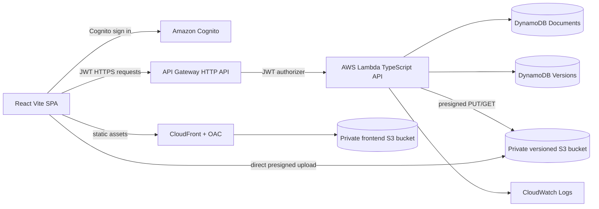

# VersionGuard

VersionGuard prevents people from accidentally sharing an outdated file. It groups related files into one document, tracks completed versions, and pauses a share when the selected version is older than the latest completed version.

> Weekend Builder Center submission title: `Weekend Annoying Task Challenge: VersionGuard`
>
> Required article tag: `#productivity`

## Product Overview

The annoying task is checking whether the attachment or link being shared is still the newest copy. VersionGuard makes that check explicit. A user creates a document group, uploads versions directly to private Amazon S3 storage, and can review or share any completed version. If Version 1 is selected while Version 3 is the latest completed version, the app displays:

> You are sharing Version 1, but Version 3 is the latest available version.

The user can use the latest version, share the older version with an optional reason, or cancel. VersionGuard records warning events, successful shares, and forced older-version shares as per-user metrics.

## User Flow

1. Sign up or sign in with an email address.
2. Create a document group such as `Project Plan`.
3. Upload a file. The browser calculates SHA-256 before requesting an upload URL.
4. VersionGuard creates a pending version and returns a short-lived presigned S3 PUT URL.
5. The browser uploads directly to private S3 and confirms completion.
6. Open Version History to inspect status, notes, size, dates, and latest badges.
7. Download or share a completed version.
8. When an older version is selected, choose Use Latest Version, Share This Version Anyway, or Cancel.
9. View warning and forced-share metrics on the dashboard.

## Architecture



The browser never receives AWS credentials and never accesses DynamoDB directly. Cognito JWT claims supply the user ID. Every document and version lookup verifies that user ID. Upload and download access is granted only through short-lived presigned URLs.

Version allocation is performed by an atomic DynamoDB update. A pending version cannot become latest. Completion checks the S3 object size and changes the version to `COMPLETE`; the document's latest version is updated only when the completed number is higher than the existing latest number.

No EventBridge or AI service is required. The warning decision is deterministic and auditable.

## AWS Services Used

- Amazon Cognito User Pools: email signup, verification, authentication, and JWTs.
- Amazon API Gateway HTTP API: authenticated API entry point.
- AWS Lambda: TypeScript API and business logic.
- Amazon S3: private, encrypted, versioned file storage and private frontend origin.
- Amazon DynamoDB: document, version, and aggregate statistics persistence.
- Amazon CloudFront: HTTPS frontend delivery with Origin Access Control and SPA fallback.
- Amazon CloudWatch Logs: Lambda diagnostics with one-week retention.
- AWS CDK v2: repeatable infrastructure definition.

## Project Structure

```text
versionguard/
  frontend/                 React + Vite application
    src/                    dashboard, dialogs, API client, tests, styles
  backend/                  Lambda API
    src/handlers/           HTTP routing
    src/services/           version business rules and S3
    src/repositories/       DynamoDB adapters and interfaces
    src/utils/              validation and JWT identity
    tests/                  deterministic service tests
  infra/                    AWS CDK v2 stack and assertions
  shared/                   shared TypeScript contracts and limits
  scripts/                  runtime configuration and deployment scripts
  README.md
  package.json
```

## Prerequisites

- Node.js 20 or newer.
- npm 10 or newer.
- AWS CLI v2 configured with a development account.
- AWS CDK v2 CLI (`npm install -g aws-cdk`).
- An AWS region with Cognito, Lambda, API Gateway, S3, DynamoDB, and CloudFront available.

This project uses the public open-source npm registry. The repository includes a local `.npmrc` that sets `https://registry.npmjs.org/`, so no company Artifactory, Bosch proxy, private npm token, or `npm login` is required. AWS CodeArtifact is also not required; it is an optional private mirror that you would configure separately only if your own AWS environment requires it.

The deployment account needs permissions to create the resources in the CDK stack and to upload the frontend bucket. Never place access keys in source code. Use an AWS CLI profile, SSO, or environment credentials managed by your shell.

## AWS CLI and CDK Setup

```powershell
aws configure
aws sts get-caller-identity
cdk bootstrap aws://ACCOUNT_ID/REGION
```

### Network and TLS troubleshooting

AWS CLI must be able to establish a trusted HTTPS connection to AWS. If your machine has `HTTP_PROXY` or `HTTPS_PROXY` set to a company proxy and AWS reports `CERTIFICATE_VERIFY_FAILED`, the proxy is replacing the AWS certificate with a certificate whose issuer is not trusted by the AWS CLI. This is a machine-network issue, not a VersionGuard dependency.

The safest options are:

1. Use a direct personal network or hotspot, temporarily remove the proxy variables from the current PowerShell session, and retry:

  ```powershell
  Remove-Item Env:HTTP_PROXY -ErrorAction SilentlyContinue
  Remove-Item Env:HTTPS_PROXY -ErrorAction SilentlyContinue
  Remove-Item Env:NO_PROXY -ErrorAction SilentlyContinue
  aws sts get-caller-identity
  ```

2. If the network requires a proxy, obtain its trusted CA certificate from the network administrator and point AWS CLI to that CA bundle. Do not disable SSL verification:

  ```powershell
  $env:AWS_CA_BUNDLE = "C:\path\to\trusted-proxy-ca.pem"
  aws sts get-caller-identity
  ```

Do not use `--no-verify-ssl` for deployment or provide AWS credentials to an untrusted connection. VersionGuard itself does not require a company proxy, certificate, Artifactory, or CodeArtifact. When direct access is unavailable and no trusted CA bundle is provided, deploy from AWS CloudShell or another trusted network instead.

Use a named profile when appropriate:

```powershell
$env:AWS_PROFILE = "my-development-profile"
$env:AWS_REGION = "us-east-1"
```

The stack uses `DESTROY` removal policies for a development environment and enables S3 auto-delete objects. Review those policies before using this stack with production data.

## Local Development

Install all workspace dependencies:

```powershell
npm run install:all
```

If a machine-wide npm configuration still forces a private registry, verify the effective project configuration from the repository root:

```powershell
npm config get registry
```

It should print `https://registry.npmjs.org/`. Do not run `npm login` for this project.

For a deployed backend, generate frontend runtime settings and start Vite:

```powershell
npm run configure:frontend
npm run dev --workspace @versionguard/frontend
```

The local app expects `frontend/public/runtime-config.json`, which is generated from CloudFormation outputs. It contains the region, Cognito User Pool ID, Cognito app client ID, API URL, and CloudFront URL. It is runtime configuration, not a credential.

## Deployment

Validate before deployment:

```powershell
npm run lint
npm run test
npm run build
npm run synth
```

Deploy the complete development environment:

```powershell
npm run deploy
```

The deployment process:

1. Deploys the CDK stack and writes `cdk-outputs.json`.
2. Generates `frontend/public/runtime-config.json`.
3. Builds the frontend after runtime configuration exists.
4. Uploads static files to the private frontend bucket.
5. Invalidates CloudFront.
6. Prints the CloudFront URL.

The deployment scripts use the active AWS CLI credentials. They do not run automatically when tests or builds are run. They also do not destroy resources.

For separate steps:

```powershell
npm run deploy:infra
npm run configure:frontend
npm run build --workspace @versionguard/frontend
npm run deploy:frontend
```

You can override deployment output values when working with an existing stack:

```powershell
$env:FRONTEND_BUCKET_NAME = "bucket-name"
$env:CLOUDFRONT_DISTRIBUTION_ID = "distribution-id"
```

## API Documentation

All routes except `/health` require a Cognito JWT in the `Authorization: Bearer TOKEN` header.

| Method | Route | Purpose |
|---|---|---|
| GET | `/health` | Returns `{ "status": "ok" }`. |
| POST | `/documents` | Creates a document group from `name` and optional `description`. |
| GET | `/documents` | Lists only the authenticated user's documents. |
| GET | `/documents/{documentId}` | Returns an owned document. |
| GET | `/documents/{documentId}/versions` | Returns owned versions newest first. |
| POST | `/documents/{documentId}/versions/presign` | Validates metadata, allocates a version, stores PENDING, and returns a 15-minute PUT URL. |
| POST | `/documents/{documentId}/versions/{versionNumber}/complete` | Confirms S3 existence/size and marks the version COMPLETE. |
| GET | `/documents/{documentId}/versions/{versionNumber}/download-url` | Returns a 15-minute private GET URL. |
| POST | `/documents/{documentId}/versions/{versionNumber}/share` | Shares latest or returns `409 STALE_VERSION`; `force: true` records an older-version share. |
| GET | `/metrics` | Returns document, completed-version, share, warning, forced-share, and latest-share-rate metrics. |

Share statistics are defined as follows:

- `staleWarnings` increments when an older-version share is blocked with `409`.
- `totalShares` increments only after a share URL is successfully generated.
- `forcedOlderShares` increments only after a forced older share succeeds.
- `latestSharePercentage` is latest-version shares divided by total successful shares, or zero when there are no shares.

Presigned share URLs are bearer URLs and expire after 15 minutes. They are not stored as permanent public links. Anyone holding a valid URL can access that object until expiration.

## Security Notes

- S3 buckets block all public access and enforce TLS.
- Upload objects use server-side encryption and S3 versioning.
- Filenames reject path separators, traversal patterns, control characters, and unsafe S3 path input.
- Files over 25 MB are rejected.
- Cognito JWT `sub` is the only user identity accepted by the API.
- Ownership is checked for every document and version operation.
- DynamoDB is never exposed to the browser.
- Lambda receives only the table and bucket permissions it needs.
- Internal AWS errors are logged to CloudWatch and replaced with a generic API response.
- This development stack uses destructive removal policies; do not use it unchanged for production records.

## Testing and Quality Checks

```powershell
npm run lint
npm run test
npm run build
npm run synth
```

The backend tests use repository and S3 fakes, so they do not require AWS credentials. They cover document creation, sequential allocation, latest completed-version selection, pending exclusion, latest and stale shares, forced shares, ownership checks, duplicate hashes, file size, and filename validation. Frontend tests cover dashboard rendering, latest badges, create-dialog behavior, and upload progress. CDK assertions cover private encrypted/versioned storage, table keys, Cognito, JWT authorization, and CloudFront.

## AWS Cost Considerations

The stack is designed for a small development demo and does not create EC2 instances, RDS databases, NAT gateways, OpenSearch domains, provisioned DynamoDB capacity, or other always-on infrastructure. DynamoDB uses pay-per-request capacity and point-in-time recovery is intentionally disabled for this challenge to avoid an unnecessary backup charge. Lambda, HTTP API, Cognito, S3, DynamoDB, CloudWatch Logs, and CloudFront may be covered by AWS Free Tier quotas or new-account credits, but Free Tier eligibility, duration, quotas, region, and pricing change by account and date.

AWS Free Tier is a usage allowance, not a guarantee that a deployment can never generate a bill. The largest practical risks for this application are S3 storage and requests, S3 data transfer, CloudFront data transfer and invalidations, Cognito verification emails, API requests, Lambda execution, DynamoDB requests, and CloudWatch log storage. Keep the demo small: upload only a few files below 25 MB, avoid repeated cache invalidations, avoid load testing, and delete the stack after the challenge. Check the AWS Billing console and set a zero-spend or low-cost budget alert before deployment. No AWS service is intentionally used as a paid-only dependency, but only AWS can determine the exact Free Tier status for your account.

## Cleanup

The deployment process never destroys resources automatically. When the environment is no longer needed:

```powershell
cdk destroy VersionGuardStack
```

Confirm the S3 buckets are empty if a custom production policy prevents CDK auto-delete. Also remove local `cdk-outputs.json` and `frontend/public/runtime-config.json` if this directory will be shared publicly.

## Weekend Challenge Submission

Publish an AWS Builder Center article of at least 500 words with:

- Title: `Weekend Annoying Task Challenge: VersionGuard`
- Tag: `#productivity`
- Vision and the annoying task being solved.
- How the app was built, including key decisions and challenges.
- AWS services and architecture overview, with the diagram above or an image.
- What was learned.
- A working CloudFront URL or public GitHub repository link.
- Screenshots or a short video showing the stale warning and latest-version action.

Record the final URL and public repository in the submission article and the README before publishing. The challenge window listed by AWS is July 31, 2026 at 12:00 AM PT through August 3, 2026 at 1:00 PM PT.

## Demo Script

1. Sign in.
2. Create `Project Plan`.
3. Upload Version 1.
4. Upload Version 2.
5. Open Version History.
6. Select Version 1.
7. Click Share.
8. Show the stale-version warning.
9. Select `Use Latest Version`.
10. Copy the latest share link.
11. Show the warning metric on the dashboard.

For a stronger live demonstration, leave Version 2 pending once, show that Version 1 remains latest, complete Version 2, then repeat the stale-share flow and show the metric change.
